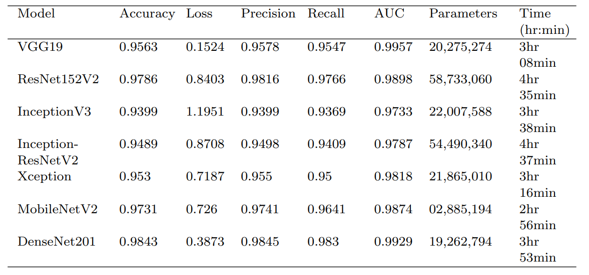

# Crop_Diagnosis_and_Monitoring_Application

## Table of Contents
1. [Outcome](#outcome)
2. [Motivation](#motivation)
3. [Methodology](#methodology)
    1. [Crop Diagnosis](#crop-diagnosis)
       1. [Data Acquisition](#data-acquisition)
       2. [Data Preparation](#data-preparation)
       3. [Diagnosis](#diagnosis)
       4. [Results](#results)
          1. [Results with Default Conditions](#Results-with-Default-Conditions)
          2. [Hyperparameter Tuning](#hyperparameter-tuning)
    2. [Crop Monitoring](#Crop-Monitoring)
       1. [Components](#components)
       2. [Hardware Configuration](#hardware-configuration)
    3. [Recommendation](#Recommendation)
    4. [Mobile Application](#Mobile-Application)
4. [Conclusion](#conclusion)
## Outcome
This project outcomes includes a single mobile application with crop disease detection, crop monitoring and farming recommendations.
* Farmer can take a picture of unhealthy leaf and app would detect the disease of the leaf.
* The application acts as a dashboard for the sensors deployed in the field and farmer can control actuators like water pump, sound sensor and LEDs from the application.
* Based on the data received from the sensors and the detected disease, the app will suggest what should be done next.
## Motivation
During my volunteer work at the Centre for Social Action, a socio-economic organization in CHRIST University, I had the opportunity to attend a camp in Kolar, a village situated near the border of Andhra Pradesh and Karnataka in India. During my three-day stay, I interacted with the villagers, who were all farmers, and discovered that there were several issues that required attention, but most of them were beyond my capacity to solve. Despite the camp being unrelated to academics, I identified a problem that I believed I could address. I observed that the majority of the villagers had limited knowledge about which fertilizers to use for their crops. Typically, they used 2-3 brands of fertilizers for each type of disease and applied the same chemical ratios to their crops, even when confronted with various diseases. This realization became the impetus for this project.
## Note
I lost most of my codes in my university drive. But the below resources contain most of the information about my work.
1. [My Undergrad Thesis](https://github.com/nvmcr/Crop_Diagnosis_and_Monitoring_Application/blob/main/ProjectReport_compressed.pdf) (Its more than 100 pages and includes code snippets, all hardware schematic diagrams and concepts involved.)
2. N. V. Megha Chandra Reddy, K. A. Reddy, G. Sushanth and S. Sujatha, "A versatile approach based on convolutional neural networks for early identification of diseases in tomato plants," International Journal of Wavelets, Multiresolution and Information Processing (IJWMIP), pp. 2150043, 2021, doi: 10.1142/S0219691321500430. [Link](https://doi.org/10.1142/S0219691321500430)
3. N. V. Megha Chandra Reddy, K. A. Reddy, Sushanth. G and Sujatha. S, "Plant Disease Diagnosis and Solution System Based on Neural Networks," Indian Journal of Computer Science and Engineering (IJCSE), vol. 12, no. 4, pp. 1084-1092, 2021, doi: 10.21817/indjcse/2021/v12i4/211204218. [Link]( https://doi.org/10.21817/indjcse/2021/v12i4/211204226)

## Methodology
The main aim of this project is to create an end-to-end system for the farmers providing
every technological solution to the problems they face. This project aims to achieve the
monitoring of the crop using IoT. The significant factors affecting crop productivity such
as humidity, temperature, the moisture content in the soil, rain, and animal intrusion
should be monitored. Actuators should be used based on the processing of the sensor’s
data. In case of any disease attack, disease detection should be done effectively and
efficiently. All these tasks should be available in a single mobile application for the
farmer. The entire project can be divided into four sub-categories of diagnosis, monitoring, recommendation and mobile application.
### Crop Diagnosis
The detailed flow diagram of the proposed system is shown in below figure. The flow chart
can be broadly classified into 3 parts namely Data Acquisition, Data processing and
Classification. 

#### Data Acquisition
Images of diseased leaves were taken from an open access repository of images called PlantVillage. The dataset includes over 87000 images of 14 crops, such as tomatoes, apples,
blueberry, grapes, raspberry, potatoes, strawberry, soybeans and squash. Tomato
was selected as the target crop from the above mentioned 14 crops. Training and validation sets are generated from the total dataset in the ratio of 80:20 respectively. Around 50 images in every category from the training set are randomly picked and are withdrawn from training folders for
testing purpose. The size of all the images is 256 x 256 and the format employed
is jpeg.

#### Data Preparation
For Convoluted Neural Network (CNN) classifier, dataset images should be preprocessed to gain stability for improved feature extraction. The noise in the images of
the dataset used is minimal, so noise removal was not used in this data preprocessing. For CNN classifiers used, the image size requirement is 224 x 224 pixels. So, the
images were resized to the required pixels. Data standardization is performed by
splitting all pixel values. It is also ensured that the several default values involved
in initialization and termination are as per requirement.

Typical deep convolutional neural networks contain millions of parameters; therefore, stupendous amounts of data are required. Otherwise, the deep neural network
may not be robust or it overfits. The main purpose of using augmentation is to
populate the dataset and introduce slight distortion to the images which help in
reducing overfitting while training the model. The data augmentation process was
conducted to the training database which includes rescaling, setting both sheer and
zoom range to 0.2 and doing a horizontal flip. Whereas only rescaling was done
for the testing set.
#### Diagnosis
Generally, convolutional neural networks (CNN) are used for creating a machine learning model that works on the unlabeled image inputs and converts them to corresponding
classification output labels. But, to train such neural networks, a lot of data is needed
which is not feasible. But with transfer learning, a solid machine learning model can
be built with comparatively minimal training data because the model is already pretrained but on different data. For leaf disease detection, from popular
architectures like VGG, ResNet, Inception, MobileNet and DenseNet, one model per
architecture is analyzed.The models used are VGG19, ResNet152V2, InceptionV3, InceptionResNet152V2, Xception, MobileNetV2 and DenseNet201. The architecture of
the proposed model for a single crop shown below consists of a pre-trained model followed by a reshape layer, a flatten layer, a dense layer, and finally followed by a Softmax activation
function to do classification. 

#### Results
##### Results with Default Conditions
For all models, a batch size of 32 has been used and the model has been trained for 30
epochs. The number of steps per epoch was equal to the length of the training set and
the number of validation steps was equal to the length of the test set. Model accuracy, loss,
precision, recall and AUC are plotted to evaluate the performance of each model. From Table, it can be inferred that DenseNet201 performed with the highest accuracy of 98.43% and loss of 0.3873 followed closely by
ResNet152V2 and MobileNetV2 with 97.86% and 97.31% accuracies respectively.
But DenseNet201 and ResNet152V2 took a large training time too. VGG19 trained
exceptionally well with a loss of 0.1524 but can only attain an accuracy of 95.63%.

##### Hyperparameter Tuning
To examine the effect of the number of epochs in model performance, all models
are trained for 10, 30 and 50 epochs respectively. Except for the number of epochs,
remaining all parameters were set the same as in default conditions. The results of
the experiments on epochs can be seen in below Table. It can be explicitly seen that an
increase in the number of epochs is significantly improving the model performance
for most of the models. DenseNet201 achieved an outstanding accuracy of 99.04%
at the 50th epoch. But the accuracy didn’t keep on increasing with the increase of
epochs. The accuracy of the models became almost stable by 50 epoch. So, 50 epochs would be the ideal value for attaining the best performance from all the models.

From previous experiments, it can be observed that DenseNet201, ResNet152V2
and MobileNetV2 performed better than other models. So, for the batch size experiment only these three models are used for experimentation. Batch size is the
number of training samples considered in one iteration. In this experiment, batch size was set to 16, 32 and 64 for DenseNet201, ResNet152V2 and MobileNetV2
models. The number of epochs set for all the models is 50. Except for the batch
size and epoch, remaining all parameters were set the same as in default conditions.
Below Table shows the results of the used CNN models. As shown, an increase in batch
size is not improving the corresponding model’s performance. As a higher batch size
consumes more memory and needs high computational power, a lower batch size of
16 is desirable.
The best accuracy of 99.06% is attained by DenseNet201 with a batch size of 16.
Even ResNet152V2 got a good accuracy of 98.5% but it requires more computation and training time due to a large number of parameters. MobileNetV2 also
achieved a high accuracy of 98.19%. Moreover, MobileNetV2 has lesser parameters
that consume less memory and less computation which lead to lesser training time.
MobileNetV2 model size is very small which is extremely handy for mobile devices. Training time can be made even quicker by choosing an epoch of
30 which gives slightly lower accuracy but in a faster time.

### Crop Monitoring
The work completed in the crop monitoring is all the sensors are integrated with the
Arduino and the sensor’s data is transmitted from the Arduino with the help of LoRa
transmitter. The transmitted data is received by the LoRa receiver and the received data
is sent to the NodeMCU which again sends the data to the cloud.
#### Components
The following hardware components are used for the crop monitoring:
• Soil Moisture Sensor
• DHT-11 Sensor
• Rain Sensor
• Motion Sensor (PIR)
• Submersible water pump
• Relay
• Speaker
• LED
• 9v Battery
• Jumper wires
• Arduino Uno
• LoRa Module
• Wi-Fi Module
#### Hardware Configuration
Appropriate sensors were used for
soil moisture, rain, motion, temperature and humidity measurements. Then the sensors
were integrated with the Arduino and integrate all these sensors with the Arduino Board.
Then the Arduino board transmits the sensor data to the LoRa transmitter. The LoRa
transmitter transmits the information to the LoRa receiver which in turn sends the data to
the cloud through Wi-FI module. The overall architecture of crop monitoring is shown below.

The below figures shows the schematic diagrams of the Transmitter and Receiver
side respectively.

### Recommendation
This [link](https://github.com/7NNS7/Recommendation-System-for-Farming) should provide the necessary code and info.
### Mobile Application
Partial flowchart of the application built is shown below.

Below are the snapshots of different pages in application.

## Conclusion
The aim of the project is to provide farmers with an end-to-end system that can bolster
the crop productivity. The end-to-end system includes both crop monitoring system and
crop diagnosis system integrated in a single mobile application. Thus, the farmer can
rely on this mobile application for everything related to his field. We used various sensors to gather important information on factors that affect productivity. All these sensors
are integrated with the Arduino Uno and this Arduino is again connected to LoRa transmitter. The LoRa transmitter sends the sensor data to the LoRa receiver. Single LoRa
receiver is capable to receiving the data from multiple transmitter thus saving equipment and in turn decreasing cost of the system. The LoRa receiver sends the data to
ESP8266 which sends the data to the server. This server is connected to the mobile application, thus showing the live sensor data. On the crop diagnosis side, Convolutional
Neural Networks are used in order to train a model that can detect diseases from the leaf
image. The model is trained with help of a huge leaf images database. The model is
stored in a .h5 file and this file is uploaded into the mobile application. Thus the single
application provides both crop monitoring and crop diagnosis.
